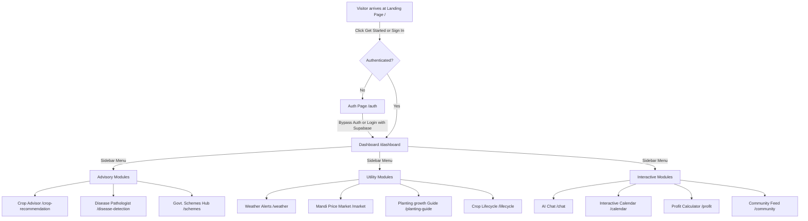
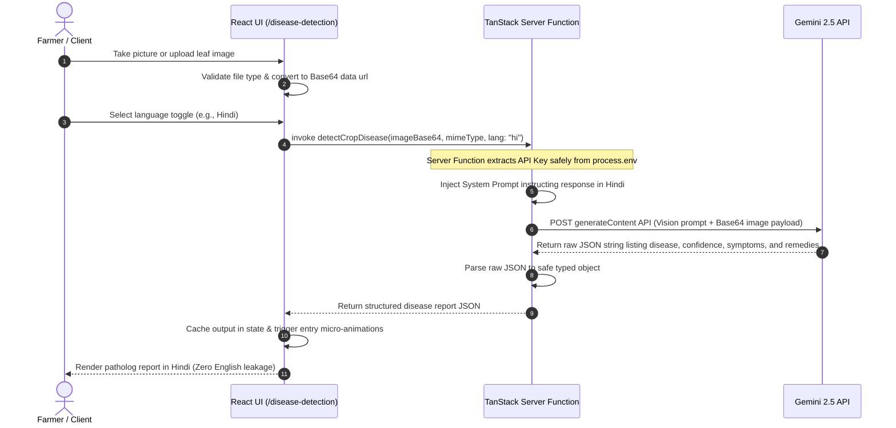
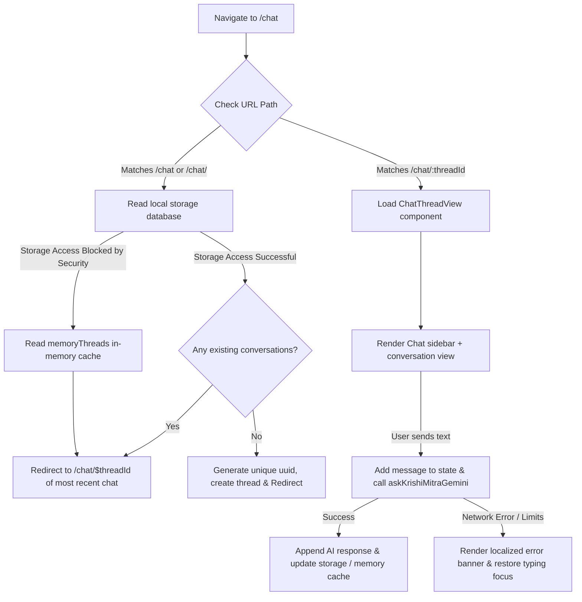

# KrishiMitra AI — Detailed System Workflows

This document outlines the detailed user journeys, system architectures, and sequences for the core features of KrishiMitra.

---

## 1. User Journey & Feature Navigation Flow

This flowchart shows how a farmer interacts with the KrishiMitra application, from landing on the homepage to navigating different dashboard modules.

---

## 2. Technical Sequence: AI Plant Disease Pathologist

This sequence diagram illustrates the lifecycle of a plant disease analysis request, starting from leaf camera capture to generating localized remedies.

---

## 3. Server-Client Boundary: Crop Recommendation Workflow

This workflow represents the data transfer and mapping that happens during soil-to-crop recommendation advisory.

1.  **Form Input**: Farmer selects soil type (e.g. `Black / Regur`), season (e.g. `Rabi`), previous crop (e.g. `Wheat`), and water availability.
2.  **API Translation Mapping**:
    *   Dropdown displays translated keys (e.g., `काली मिट्टी` in Hindi).
    *   Form handles keep track of standard English keys (`black`) for backend queries.
3.  **Server Call Execution**:
    *   Form triggers `getCropRecommendation` passing normalized parameters and client language.
    *   Server function maps parameters to precise agronomic terms for Gemini's optimal reasoning.
4.  **AI Formulation**:
    *   Gemini processes parameters and compiles 3 suitable crops.
    *   Replies containing crop names, suitability scores, and localized tips.
5.  **Re-Hydration & Render**:
    *   Results display on customized stat cards showing yield potentials, local mandi prices, and government MSP matches.

---

## 4. State Management: AI Chat Assistant & Storage Fallbacks

This workflow outlines the redirection sequence and fallback mechanics when loading the AI chatbot.

---

## 5. Live translation & Synchronization Workflow

How selecting a language from the navbar translates static configurations and dynamic assets instantly:

*   **Language Selection**: Farmer clicks the Globe icon in the navigation bar and selects a language (e.g., `मराठी` / Marathi).
*   **Active i18n change**: `i18n.changeLanguage("mr")` is triggered.
*   **CSS and Document Reflow**: Local storage updates `"km_lang"` key so the language settings survive page refreshes.
*   **Static Data Mapping**: All local dataset imports (government schemes in `schemes-data.ts`, calendars in `calendar.tsx`) check the new language index and swap strings in-place.
*   **Dynamic UI Adjustments**: Elements (like labels inside the Recharts cost breakdowns) recalculate dynamically to show currency metrics and translated categories.
