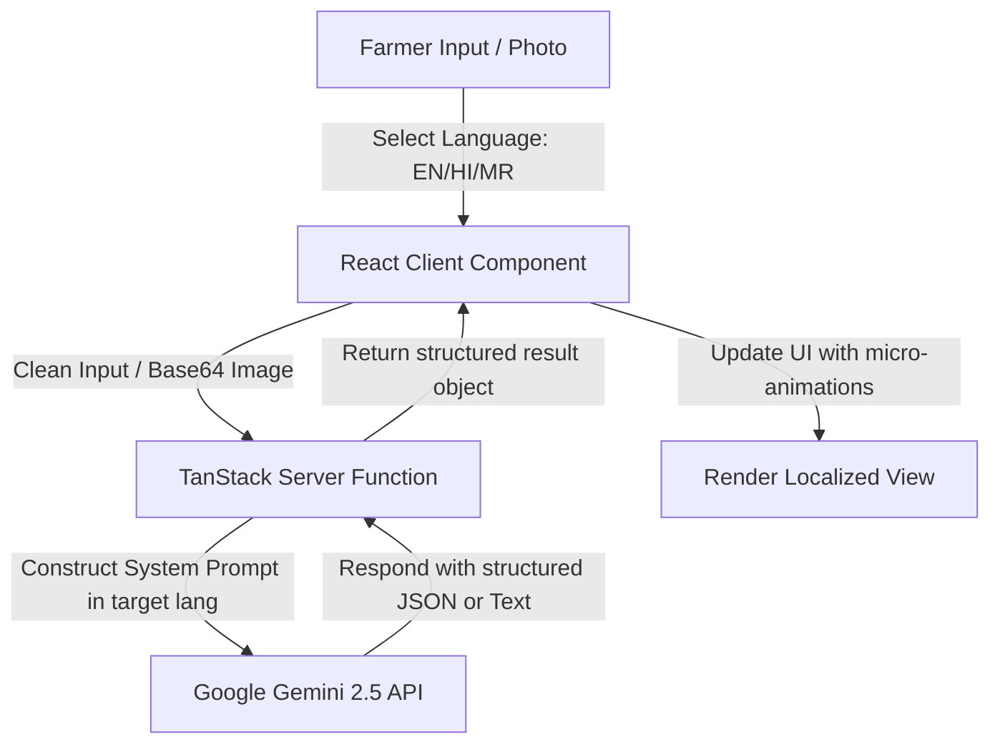

# KrishiMitra AI — Project Documentation

KrishiMitra is a state-of-the-art, AI-powered agricultural advisory platform designed ground-up for India's 120 million farmers. It provides critical, real-time insights ranging from soil health to market prices in multiple Indian languages (English, Hindi, and Marathi), helping farmers optimize yields, mitigate risks, and maximize profits.

---

## 1. Technology Stack

The application is built using a modern, performant, and type-safe web stack:

*   **Core Framework**: [React 19](https://react.dev/) & [TypeScript](https://www.typescriptlang.org/)
*   **Routing & Full-Stack Architecture**: [TanStack Start](https://tanstack.com/router/v1/docs/start/overview) (incorporating TanStack Router v1) for full-stack file-based routing, server functions, and clean client-server boundaries.
*   **AI Integration**: [Google Gemini 2.5 Flash](https://deepmind.google/technologies/gemini/) API accessed directly via server-side endpoints for secure, rate-limited processing of crop recommendations, chat interaction, and disease diagnosis reports.
*   **Database & Auth Provider**: [Supabase](https://supabase.com/) for authentication and user sessions, integrated via `@supabase/supabase-js`.
*   **Styling & UI**:
    *   **Tailwind CSS v4** for clean, utility-first styling.
    *   **Vanilla CSS** for modern UI adjustments, glassmorphism aesthetics, custom themes, and gradient backdrops.
    *   **Framer Motion** for premium micro-animations, layout transitions, and interactive visual elements.
    *   **Lucide React** for icons.
    *   **Recharts** for visualizing historical mandi price fluctuations and expense breakdowns.
*   **Internationalization (i18n)**: [i18next](https://www.i18next.com/) & [react-i18next](https://react.i18next.com/) for translation dictionaries and real-time client-side language switching.

---

## 2. File Organization & Architecture Review

### Is the codebase properly organized?
**Yes, the files are exceptionally well-organized and adhere to modern React and TanStack Router standards.** The structure separates UI layout, routing logic, static datasets, and configuration layers:

```
src/
├── components/
│   ├── app/                # Application & Dashboard layouts (e.g., DashboardShell.tsx)
│   ├── site/               # Public landing page elements (Navbar, Footer, CountUp animations)
│   └── ui/                 # Atomic design components (Shadcn-based buttons, selects, inputs, dialogs)
├── hooks/                  # Custom React hooks (e.g., useAuth.ts)
├── integrations/
│   └── supabase/           # Supabase client instances and query helpers
├── lib/
│   ├── translations/       # Modular localization dictionaries (en.ts, hi.ts, mr.ts)
│   ├── crop-lifecycle-data.ts # Massive translated static dataset for growth timelines
│   ├── planting-guide-data.ts # Step-by-step procedures and traditional wisdom databases
│   ├── schemes-data.ts     # Curated Indian government scheme listings in 3 languages
│   ├── gemini.functions.ts # Secured Server Functions making direct calls to Google Gemini API
│   ├── i18n.ts             # Internationalization setup and configuration
│   └── utils.ts            # Utility functions (cn class merging, safe UUID generation)
├── routes/                 # File-based TanStack Router pages mapping directly to URLs
│   ├── __root.tsx          # Root app provider container and styles
│   ├── index.tsx           # Premium public Landing page
│   ├── dashboard.tsx       # Farmer's unified overview cockpit
│   ├── chat.tsx            # AI Chatbot assistant layout and main thread view
│   ├── chat.$threadId.tsx  # Dynamic parameterized route rendering individual chat histories
│   ├── crop-recommendation.tsx # Soil/Water input advisor
│   ├── disease-detection.tsx   # Visual plant pathologist analyzer
│   ├── weather.tsx         # Hyperlocal weather forecast & agricultural safety alerts
│   ├── market.tsx          # Mandi price lists, charts, and trends
│   ├── schemes.tsx         # Government subsidy directory
│   ├── calendar.tsx        # Customized agricultural task calendars
│   └── ...                 # Other routes (auth, planting-guide, profit, settings)
├── routeTree.gen.ts        # Auto-generated TanStack Router route mapping file
└── main.tsx                # Client-side bootstrap entrypoint
```

### Highlights of the Directory Structure:
*   **Modular Translations**: Localizations are split into standalone files under `src/lib/translations/` instead of one giant JSON tree, improving compiler build times and readability.
*   **Decoupled Server Functions**: Sensitive logic (like API requests to Gemini containing keys) is placed in `src/lib/gemini.functions.ts` as `createServerFn` constructs, keeping key values off the client bundle.
*   **Local Storage Safety**: Storage integrations are robustly isolated and wrapped in try-catch logic with in-memory fallbacks to handle users operating in private browsing settings.

---

## 3. How It Works (System Workflow)



1.  **Language Initialization**: The client initializes using the saved language in the user's storage (`km_lang`). If blocked by security policy, it falls back to `"en"`. The `i18n` framework loads the matching translations.
2.  **Navigation and State Management**: TanStack Router coordinates dynamic routing (e.g. `/chat/$threadId` handles specific conversations).
3.  **Advisory Calculations**: The client gathers parameters (e.g., Soil = Clay, Water = Irrigated) and feeds them to the backend server functions.
4.  **AI Query Orchestration**: Server functions attach the target language string (e.g. `"Hindi"`) to the system prompts, instructs Gemini to reply strictly in that language, and queries Gemini.
5.  **Render Cycle**: The resulting advice (symptoms, remedies, crop varieties) is sent back to the React UI and rendered seamlessly without any mixed-language cards.

---

## 4. Key Uses & Core Features

*   **AI Crop Recommendation**: Analyzes soil texture, watering conditions, season, and acreage to recommend the top three most profitable crops, including expected yield and difficulty scores.
*   **Plant Disease Diagnosis**: Allows farmers to upload photos of diseased crop leaves. The AI model detects the visual symptoms, names the disease, and provides instant treatment steps (biological and chemical).
*   **Dynamic Crop Calendar**: Generates a day/week/month calendar detailing farming tasks (sowing, fertilizers, irrigation, harvesting) based on the chosen crop and planting date.
*   **AI Chat Assistant**: An interactive chat window for asking open agricultural questions (e.g. "How to manage stem borers in paddy?"), featuring custom Indian agricultural suggestion chips.
*   **Mandi Market Watch**: Displays commodity price lists for various Indian states and dynamically visualizes price fluctuations over a 12-month period using interactive line charts.
*   **Government Schemes Hub**: Directs farmers to eligible government support programs (e.g., PM-KISAN, PMFBY, KCC) matching their region.
*   **Hyperlocal Weather & Alerts**: Connects to geocoding systems to yield temperature, wind speed, UV indices, and localized agricultural warnings (e.g., advising harvesting early due to heavy rain).

---

## 5. Key Benefits for Farmers

*   **Zero Language Barriers**: The entire app, including dynamically generated AI responses, maps, forms, and charts, updates instantly when selecting English, Hindi, or Marathi.
*   **High Performance on Low-End Devices**: By offloading computation to server-side functions and building optimized client bundles, the interface remains smooth and quick.
*   **Works in Restrictive/Insecure Environments**: Incorporates fallback mechanisms for location geocoding (OpenStreetMap Nominatim if Open-Meteo fails), safe UUID generation, and in-memory caches if standard storage features are blocked.
*   **Premium User Experience**: Styled using clean glassmorphic panels, structured headers, and smooth transitions, making the advice easy to read under daylight conditions.

---

## 6. Environmental Configurations & Security

> [!IMPORTANT]  
> All environment configuration settings—specifically **`GEMINI_API_KEY`**, **`SUPABASE_URL`**, and **`SUPABASE_ANON_KEY`**—are managed securely in the runtime environment on the server side. 
> 
> The **`.env`** file (which holds local environment variables) is explicitly excluded from the git repository via the **`.gitignore`** configuration. This prevents accidental credential leaks or publishing private API credentials online.
